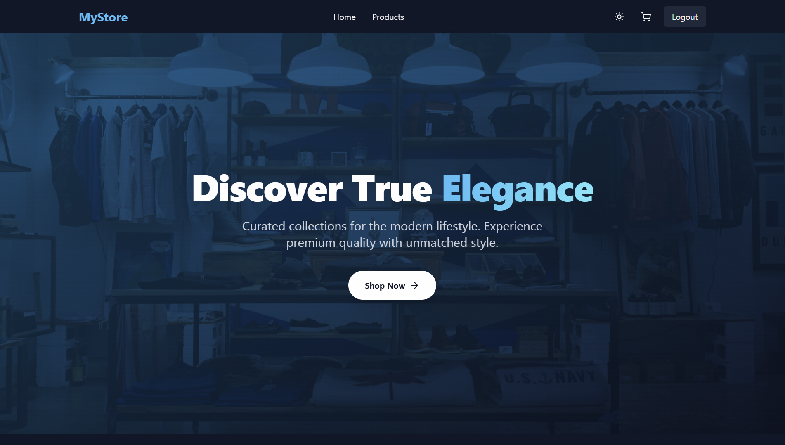
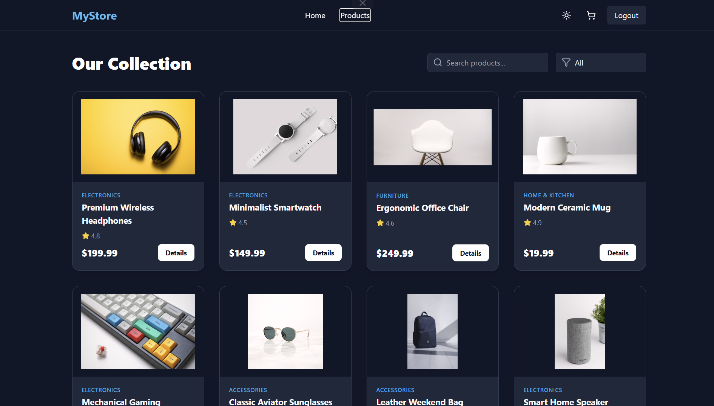
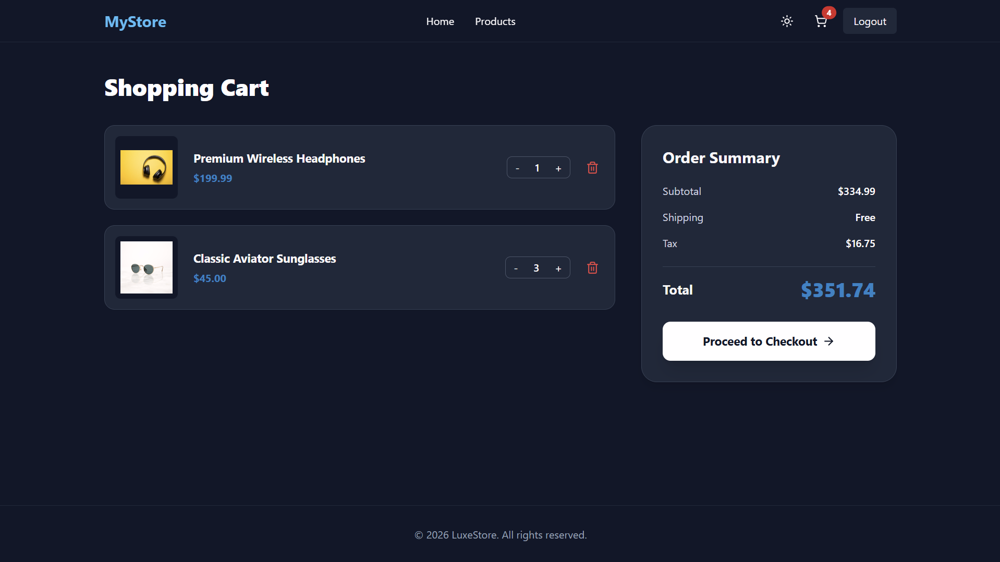
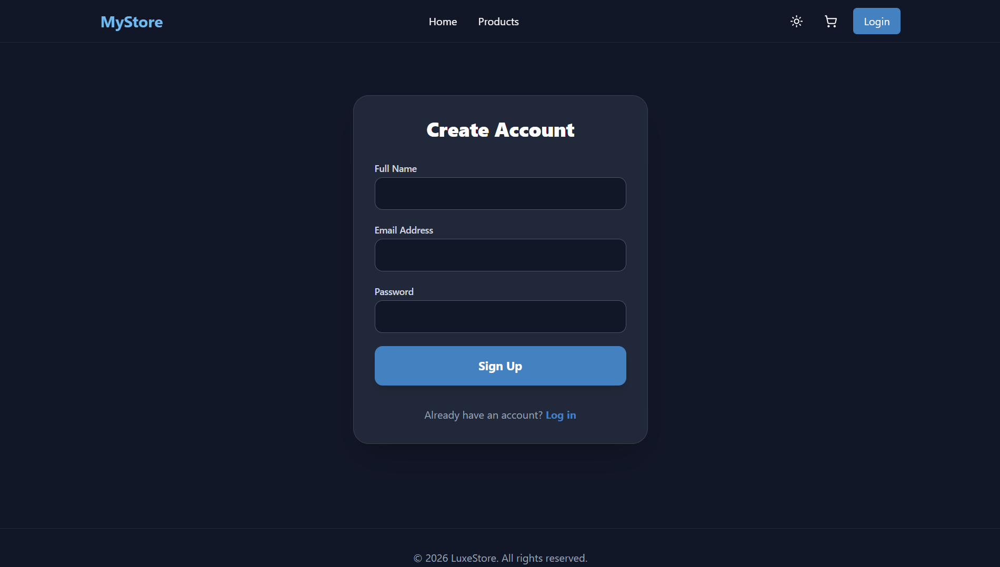
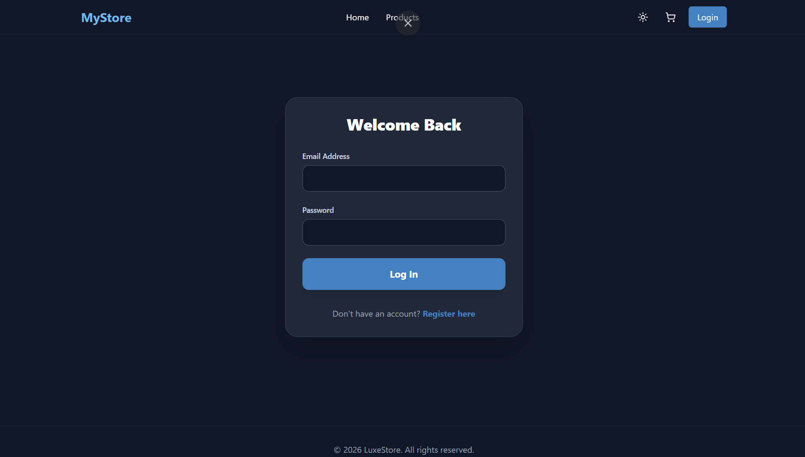

# 🛒 Full-Stack Modern E-Commerce Website

A visually stunning, fully responsive, and professional e-commerce platform built as a portfolio project. Demonstrates full-stack skills with a **React.js** frontend and a **Core PHP + MySQL** backend.

---

## 🖥️ Live Preview

> Run locally by following the setup instructions below.

---

## ✨ Features

- 🎨 **Premium UI** — Glassmorphism design, soft shadows, and vibrant color palette
- 🌙 **Dark / Light Mode** toggle with smooth transitions
- 📱 **Fully Responsive** — Works on Desktop, Tablet, and Mobile
- 🎬 **Framer Motion Animations** — Smooth page transitions and hover effects
- 🛍️ **Product Catalog** — Browse and filter products from a MySQL database
- 🛒 **Shopping Cart** — Add/remove/update quantities (synced with backend)
- 🔐 **User Authentication** — Register, Login, and protected routes
- ⚡ **Fast Development** — Vite for blazing-fast HMR

---

## 🧰 Tech Stack

| Layer      | Technology                                                        |
|------------|-------------------------------------------------------------------|
| Frontend   | React.js (Vite), Tailwind CSS, Framer Motion, Lucide React       |
| Routing    | React Router DOM v7                                               |
| State      | React Context API (Auth, Shop, Theme)                             |
| Backend    | Core PHP (REST-like API)                                          |
| Database   | MySQL                                                             |
| HTTP       | Axios                                                             |

---

## 📁 Project Structure

```
E-Commerce/
├── backend/
│   ├── api/
│   │   ├── cart.php        # Cart CRUD operations
│   │   ├── cors.php        # CORS headers
│   │   ├── login.php       # User login
│   │   ├── products.php    # Product listing
│   │   └── register.php    # User registration
│   ├── config/
│   │   └── db.php          # Database connection
│   └── database.sql        # DB schema + seed data
└── frontend/
    ├── public/
    ├── src/
    │   ├── components/
    │   │   ├── Footer.jsx
    │   │   ├── Layout.jsx
    │   │   └── Navbar.jsx
    │   ├── context/
    │   │   ├── AuthContext.jsx
    │   │   ├── ShopContext.jsx
    │   │   └── ThemeContext.jsx
    │   ├── pages/
    │   │   ├── Cart.jsx
    │   │   ├── Home.jsx
    │   │   ├── Login.jsx
    │   │   ├── ProductDetails.jsx
    │   │   ├── Products.jsx
    │   │   └── Register.jsx
    │   ├── App.jsx
    │   ├── index.css
    │   └── main.jsx
    ├── package.json
    ├── tailwind.config.js
    └── vite.config.js
```

---

## ⚙️ Prerequisites

- **Node.js** v18+ — [Download](https://nodejs.org/)
- **PHP** v8.0+ — [Download](https://www.php.net/)
- **MySQL** — via [XAMPP](https://www.apachefriends.org/), [WAMP](https://www.wampserver.com/), or [MAMP](https://www.mamp.info/)

---

## 🚀 Setup Instructions

### 1. Clone the Repository

```bash
git clone https://github.com/Frenik06/E-Commerce.git
cd E-Commerce
```

### 2. Database Setup

1. Open your MySQL client (e.g., **phpMyAdmin** or **MySQL Workbench**).
2. Create a database named `ecommerce_db`:
   ```sql
   CREATE DATABASE ecommerce_db;
   ```
3. Import the schema and seed data:
   ```bash
   mysql -u root -p ecommerce_db < backend/database.sql
   ```
   Or use phpMyAdmin → Import → select `backend/database.sql`.

### 3. Backend Setup

1. Open `backend/config/db.php` and update your credentials:
   ```php
   $host = 'localhost';
   $db   = 'ecommerce_db';
   $user = 'root';       // your MySQL username
   $pass = '';           // your MySQL password
   ```
2. Start the PHP development server:
   ```bash
   cd backend
   php -S localhost:8000
   ```
   > The backend API will be available at `http://localhost:8000`

### 4. Frontend Setup

Open a **new terminal** and run:

```bash
cd frontend
npm install
npm run dev
```

> The app will be available at `http://localhost:5173`

---

## 🔌 API Endpoints

| Method | Endpoint                   | Description              | Auth Required |
|--------|----------------------------|--------------------------|---------------|
| GET    | `/api/products.php`        | Get all products         | No            |
| POST   | `/api/register.php`        | Register a new user      | No            |
| POST   | `/api/login.php`           | Login and get user data  | No            |
| GET    | `/api/cart.php`            | Get user's cart          | Yes           |
| POST   | `/api/cart.php`            | Add item to cart         | Yes           |
| PUT    | `/api/cart.php`            | Update cart item qty     | Yes           |
| DELETE | `/api/cart.php`            | Remove item from cart    | Yes           |

---

## 🌐 Deployment

### Frontend (Vercel / Netlify)

```bash
cd frontend
npm run build
```
Deploy the generated `frontend/dist/` folder to **Vercel** or **Netlify**.

> ⚠️ Update the API base URL in your context files to point to your live backend before building.

### Backend (Shared Hosting)

1. Upload the `backend/` folder to your hosting provider (e.g., Hostinger, InfinityFree).
2. Import `database.sql` to your remote MySQL server.
3. Update `backend/config/db.php` with your remote database credentials.

---

## 🛠️ Development Notes

- **VS Code users:** A `.vscode/settings.json` is included to suppress false CSS warnings from Tailwind's `@tailwind` directives.
- **CORS:** The `backend/api/cors.php` file handles cross-origin requests between the frontend dev server and the PHP backend.

---

## 📄 License

This project is open-source and available under the [MIT License](LICENSE).

---

## 👨‍💻 Author

**Frenik Mangukiya**  
[GitHub](https://github.com/Frenik06)

## Screenshots

### Home Page
Modern and responsive homepage featuring hero banners, featured products, categories, promotional sections, and smooth animations.



---

### Product Listing Page
Interactive product listing page with category filters, search functionality, sorting options, and responsive product cards.



---

### Product Details Page
Detailed product view with image gallery, pricing, ratings, description, and add-to-cart functionality.


---

### Shopping Cart
Responsive shopping cart with quantity management, remove items feature, and dynamic total price calculation.



---

### Authentication Pages
Modern login and registration pages with clean UI and form validation.




---

### Responsive Design
Fully responsive layout optimized for desktop, tablet, and mobile devices.


